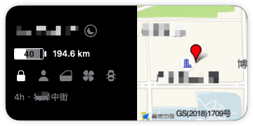
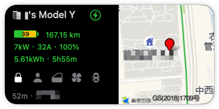

# TeslaMate Scriptable Widget

Language: **English** | [Chinese](./README.zh-CN.md)

A [Scriptable](https://scriptable.app/) widget script for TeslaMate. It shows vehicle status, range, charging state, location, and map information on the iOS Home Screen and Lock Screen.






## Table of Contents

- [Features](#features)
- [Requirements](#requirements)
- [Installation and Configuration](#installation-and-configuration)
- [Local Automated Tests](#local-automated-tests)
- [AI Development Docs](#ai-development-docs)
- [Referral Link](#referral-link)

## Features

- Vehicle name
- Vehicle state: online, sentry, asleep, suspended, driving, charging, updating, or offline
- Battery state: battery percentage, rated range, and charge limit
- Charging state: charger power, charge limit, and time remaining
- Control state: lock, driver presence, windows, climate, and doors
- Widget last update time
- Current location name
- Current location map from AMap
- Current heading
- Lock Screen widget battery display

## Requirements

- [Scriptable](http://scriptable.app)
- An [AMap developer key](https://lbs.amap.com/api/webservice/guide/create-project/get-key)
- A self-hosted [TeslaMate](https://github.com/adriankumpf/teslamate) and [TeslaMateApi](https://github.com/tobiasehlert/teslamateapi) setup

## Installation and Configuration

1. Copy `Telsa Car.js` into Scriptable.
2. Open Scriptable and run the script once. On first run, the script opens a configuration form instead of making network requests.
3. Enter the following values, then tap **Save**:
   - **AMap API Key**: the Web Service key used by the static map request.
   - **TeslaMateApi Base URL**: the service base address, for example `https://api.example.com`. Do not append `/api/v1/cars/1/status`; the script adds the vehicle path automatically.
   - **TeslaMate Web URL**: the base address of the TeslaMate web interface, for example `https://teslamate.example.com`.
4. Set the Scriptable widget parameter to the vehicle ID, for example `1`.
5. If you also want to keep the theme marker, use `dark,1` or `1,dark`.

The three values are saved as one versioned configuration file in Scriptable's iCloud Drive documents. They are never written into the script. This does not add an application "master password": access is controlled by your Apple Account and trusted devices. Treat every trusted device signed in to that Apple Account as able to read this configuration.

To update an existing configuration, run the script in the Scriptable app, choose **Manage Configuration**, edit the values, and save. Running a configured script also provides **Open TeslaMate**. Configuration dialogs are never shown from a widget refresh.

Cache files are stored in the `tesla/` folder under Scriptable documents.

### iCloud synchronization, migration, and security

The configuration is shared through iCloud Drive when every device is signed in to the same Apple Account, has iCloud Drive enabled, and allows Scriptable to use iCloud. Apple documents that iCloud Drive changes are made available on devices using that account, but this script cannot observe or promise when the system has uploaded or propagated a change. Let iCloud finish before relying on another device.

If you upgrade from a Keychain-only version, run the new script **in the Scriptable app on the old configured device**. Review the migration prompt and confirm it there. Only a confirmed, validated migration removes the old Keychain entry. Do not remove the old entry yourself first. A widget never migrates configuration or shows a migration form.

On a second device using the same Apple Account, install the script and run it once in the Scriptable app before adding or refreshing the widget. No business values need to be entered again after the configuration has arrived. A widget deliberately does not download an iCloud placeholder: if the configuration is not downloaded yet, it shows a synchronization prompt and does not contact vehicle services. Once the configuration is downloaded, it remains readable while offline; a device that has never downloaded it remains in the safe prompt state while offline.

Edit configuration on one device at a time. Concurrent edits are unsupported: there is no merge UI, and after sequential edits each device reads the version currently visible through iCloud. This is a convenience and safety boundary, not a synchronization-completion guarantee.

Apple's [standard data protection](https://support.apple.com/en-us/102651) encrypts iCloud data in transit and at rest, with recovery keys held by Apple. [Advanced Data Protection](https://support.apple.com/en-us/102651) is optional and makes iCloud Drive end-to-end encrypted with keys held by trusted devices; it has stronger recovery requirements. It is not required for this widget, and neither setting makes configuration safe on an untrusted signed-in device. See Apple's [iCloud Drive setup requirements](https://support.apple.com/guide/icloud/set-up-icloud-drive-mm203b05aec8/icloud) and Scriptable's [iCloud FileManager documentation](https://docs.scriptable.app/filemanager/) for platform behavior.

## Local Automated Tests

This repository includes a Node-based Scriptable runtime stub. It runs the original script locally and verifies the main behavior.

```bash
npm test
```

The tests cover the medium Home Screen widget, Lock Screen widget, charging state, driving state, WebView branch, and API failure cache fallback. See [docs/testing.md](./docs/testing.md) for details.

If a Scriptable `Run Script` widget has been added on the macOS desktop and real screenshots are allowed, capture the real WidgetKit rendering with:

```bash
npm run capture:widget
```

Capture a real full-color widget screenshot with:

```bash
npm run capture:widget:color
```

If an iPhone is connected over USB, trusted by the Mac, and showing the Today View, capture the real device screen with:

```bash
npm run capture:iphone
```

If iPhone Mirroring is already open, capture the mirroring window with:

```bash
npm run capture:iphone:mirror
```

Crop only the TeslaMate widget from the iPhone Mirroring screenshot with:

```bash
npm run capture:iphone:mirror:widget
```

## AI Development Docs

- [AGENTS.md](./AGENTS.md): AI collaboration rules.
- [docs/scriptable-capabilities.md](./docs/scriptable-capabilities.md): Scriptable API capabilities and development constraints.
- [docs/architecture.md](./docs/architecture.md): Project structure, data flow, and cache strategy.
- [docs/code-review.md](./docs/code-review.md): Current code review notes.
- [docs/testing.md](./docs/testing.md): Automated testing workflow.

## Referral Link

[http://ts.la/pcmg48082](http://ts.la/pcmg48082)
