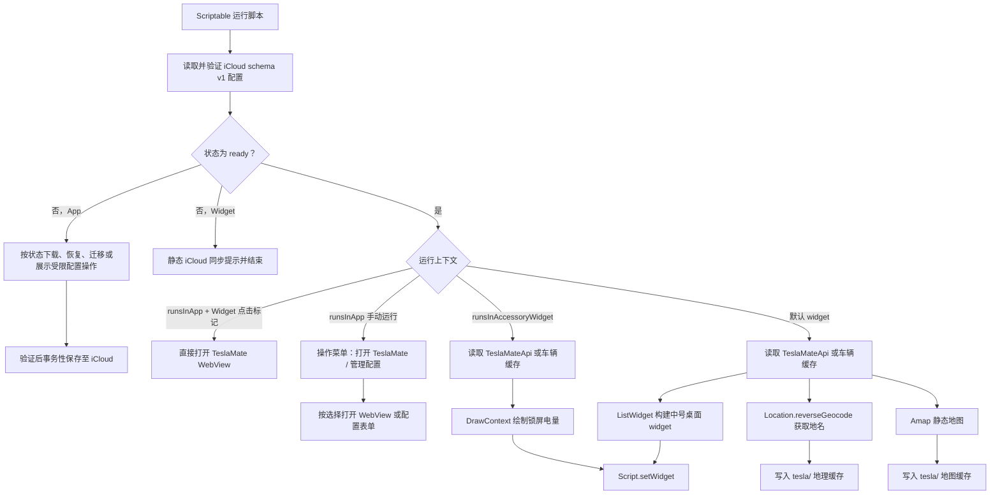

# 项目架构说明

## 文件结构

```text
.
├── AGENTS.md
├── README.md
├── README.zh-CN.md
├── Telsa Car.js
├── docs/
│   ├── architecture.md
│   ├── code-review.md
│   ├── scriptable-capabilities.md
│   ├── testing.md
│   └── *.jpg / *.png
├── package.json
└── tests/
    ├── scriptable-runtime.js
    └── scriptable-widget.test.js
```

## 运行入口

`Telsa Car.js` 是唯一 Scriptable 入口。它按运行上下文分成三条路径：

1. App 内运行：从 Scriptable iCloud documents 读取配置；文件未下载时等待下载，配置缺失、损坏或需迁移时按状态展示受限操作；配置完整时，Widget 点击来源直接打开 TeslaMate，手动运行来源显示“打开 TeslaMate / 管理配置”菜单。
2. 锁屏 accessory widget：先执行 iCloud 配置门禁；仅 `ready` 时拉取或读取缓存车辆数据并绘制圆形电量图，其他状态只显示静态同步提示。
3. 桌面 widget：先执行 iCloud 配置门禁；仅 `ready` 时拉取车辆状态、地理编码和地图并构建中号 widget，其他状态只显示静态同步提示。

项目继续采用单文件分发，用户只需安装并在 Scriptable App 内运行 `Telsa Car.js` 完成配置。仓库源码和 iCloud 运行文件保持字节一致，均不保存凭据。当前脚本已经完成 iCloud 配置状态机，并按职责划分为以下命名函数：

- `main()`：先加载运行配置，再根据 Scriptable 运行上下文分发执行路径。
- `validateBusinessConfig()`：验证三个业务字段并标准化两个 HTTP(S) 基础 URL。
- `validateICloudConfigEnvelope()`：验证 `schemaVersion`、规范化 ISO 8601 `updatedAt` 与业务字段。
- `loadRuntimeConfig()` / `saveRuntimeConfig()`：异步读取和事务性保存 iCloud 配置，并以状态结果执行脱敏降级。
- `createWidgetOpenUrl()` / `isWidgetTriggeredAppRun()`：优先通过无凭据查询参数区分 Widget 点击与 App 手动运行，并以非空 Widget 参数兼容尚未刷新的旧快照。
- `presentAppMenu()` / `presentConfigForm()`：仅在 App 手动运行或配置状态需要交互时展示操作菜单和安全配置表单。
- `renderUnavailableConfigWidget()`：任意非 `ready` 配置状态下提交无网络、无缓存副作用的 iCloud 同步提示 Widget。
- `createRuntimeContext()`：配置门禁通过后才创建缓存目录和正常 Widget。
- `openTeslaMateWebView()`：使用显式运行配置处理 App 内 TeslaMate 页面展示。
- `loadCarDataWithCache()`：统一处理 TeslaMateApi 请求和车辆缓存回退。
- `loadCarContext()`：组合车辆数据、历史坐标、刷新时间、地理信息和地图。
- `renderAccessoryWidget()`：绘制并提交锁屏圆形 Widget。
- `renderMediumWidget()`：组织中号 Widget，并分别调用车辆、电池、充电、控制状态、位置和地图渲染函数。

这种结构不依赖 `importModule()` 或构建流程，保持单文件安装体验，同时避免运行分支、缓存逻辑和 UI 绘制继续堆叠在顶层作用域。

## 数据流



## 配置项与状态机

配置不写入源码。用户首次在 Scriptable App 内运行脚本且正式、备份与旧 Keychain 配置均不可用时，先看到“重试同步 / 创建新配置 / 取消”菜单；只有明确选择“创建新配置”后，才通过 `Alert` 表单填写以下内容：

| 字段 | 含义 |
| --- | --- |
| `amapApiKey` | 高德静态地图 Web 服务 API Key |
| `teslaMateApiBaseUrl` | TeslaMateApi 基础地址；不含 `/api/v1/cars/<carId>/status`，不含 query/hash，保存时去除末尾 `/` |
| `teslaMateWebUrl` | TeslaMate Web 基础地址；不含 query/hash，保存时去除末尾 `/` |

三项内容与 `schemaVersion: 1`、规范化 ISO 8601 `updatedAt` 一起序列化到 Scriptable iCloud documents 的 `teslamate/config.v1.json`。保存只写入这五个白名单字段；`teslamate/` 不存在时通过 `createDirectory(path, true)` 显式递归创建。正式文件以外，保存事务仅可在同目录使用 `config.v1.pending.json` 和 `config.v1.backup.json`。这三个固定文件均不得进入仓库、脚本文本、日志或测试产物。

`loadRuntimeConfig()` 返回显式状态，不能用 `null` 混合失败原因：

| 状态 | 定义与处理 |
| --- | --- |
| `ready` | 正式 iCloud 文件已下载、可读取且完整通过 envelope 与业务字段验证；只有此状态可进入正常运行。 |
| `missing` | 正式与备份均不存在；App 可检查旧 Keychain 并提示重试同步或经用户确认创建新配置，Widget 仅提示同步。 |
| `unavailable` | iCloud 文件存在但未下载、下载失败、文件操作失败，或正式文件无效但备份存在且尚待 App 验证恢复；Widget 必须优先返回此状态，不得泛化为 `invalid`，App 可下载、验证恢复或重试。 |
| `invalid` | 已可读取的正式文件 JSON、schema、时间或业务字段不合法且不存在备份，或 App 完整验证后确认备份也无效；App 仅在用户明确确认后修复，Widget 仅提示同步。 |
| `legacyMigrationRequired` | 仅 App 在正式与备份均不存在时，读取并验证旧 Keychain `teslamate-widget.config.v1` 后返回的迁移候选；用户确认并写后读校验成功后才删除旧键。 |

读取流程必须遵守以下安全状态机：

```text
正式文件有效 -> ready
正式文件未下载 -> App 下载后读取 / Widget unavailable
正式文件缺失或无效且备份存在 -> App 验证恢复 / Widget unavailable
正式与备份都缺失 -> App 检查旧 Keychain / Widget missing
任何非 ready Widget -> 静态同步提示，零 Request，零车辆缓存
```

当前实现中，App 读取正式或待恢复备份时会等待 `downloadFileFromiCloud()`，再读取、解析与验证；Widget 若正式文件 `isFileDownloaded()` 为假立即返回 `unavailable`。正式文件无效但备份存在时，Widget 不验证备份且优先返回 `unavailable`，由 App 完整验证后恢复并重新读取正式文件；备份无效或恢复失败不会进入首次创建或 Keychain 迁移。旧 Keychain 仅限 App 的一次性迁移：迁移成功且 iCloud 正式文件下载、解析、完整验证并逐字段校验后调用 `Keychain.remove()`；失败时保留旧键供下次迁移，但不作为本次运行回退。有效 iCloud 文件出现后，正常路径永不访问 Keychain。

`saveRuntimeConfig()` 只由 App 的配置管理或迁移流程调用，Widget 永不写配置。所有保存都先验证并构造候选配置，确保目录存在，再写入并重读验证 pending 文件。普通配置保存随后把已验证正式文件移动为本次 backup、把 pending 移动为正式文件，重读并逐字段校验候选后清理本次 backup；移动或校验失败时只恢复本次事务创建的 backup。

有效旧 Keychain 迁移使用显式 `legacyMigration` 模式，无效旧 Keychain 修复使用相同的 legacy 新建边界。pending 完整验证后先确认正式与 backup 都缺失，再调用 Scriptable `copy(pending, config)` 非覆盖安装；官方契约保证目标正式文件已存在时 copy 失败且不会替换目标。legacy 分支与普通 backup/move 替换完全互斥，无论成功或失败都不删除 backup。copy 完成后重读正式文件并在返回成功前复查 backup；发现 backup 时中止，且只有正式文件仍逐字段等于本事务 candidate 才尝试移除 candidate，远端已替换、内容无效或暂不可读时均保留正式文件。任何失败都保留旧 Keychain，本次不进入业务请求或车辆缓存初始化。

Scriptable 不提供 iCloud 文件锁、CAS、冲突版本或上传确认 API，因此上述 copy 与复核只能关闭已观测窗口，不能构成跨设备线性化事务；复核之后仍可能发生新的远端变化。项目不支持多设备并发编辑，配置应在一台设备上依次修改，最终以 iCloud 系统当前可见版本为准。保存成功仅表示已写入本机 iCloud Drive，提示“已保存到 iCloud Drive，将由系统同步到其他设备”，不宣称已完成上传或跨设备传播。

配置门禁失败时，Widget 不会弹窗、下载 iCloud 文件、读取旧 Keychain、创建缓存目录或网络请求。日志、提示和测试输出不得包含 Key、完整私有 URL、配置文件内容、完整路径或原始异常对象。修改配置只能从 Scriptable App 内的“管理配置”入口进行。

车辆 ID 不属于安全配置，继续从 `args.widgetParameter` 中读取；未提供有效数字时默认使用 `1`。支持示例：

- `1`：使用车辆 ID 1。
- `dark,1`：保留 dark 标记，同时使用车辆 ID 1。
- `1,dark`：同上。

## TeslaMateApi 数据契约

脚本期望接口返回：

```json
{
  "data": {
    "status": {
      "display_name": "Model Y",
      "state": "online",
      "state_since": "2026-07-04T08:00:00.000Z",
      "battery_details": {
        "battery_level": 67,
        "rated_battery_range": 331.2
      },
      "car_geodata": {
        "latitude": 31.2304,
        "longitude": 121.4737
      },
      "car_status": {
        "locked": true,
        "is_user_present": false,
        "windows_open": false,
        "doors_open": false,
        "sentry_mode": false
      },
      "charging_details": {
        "charge_limit_soc": 80,
        "charger_power": 0,
        "time_to_full_charge": 0
      },
      "climate_details": {
        "is_climate_on": false
      },
      "driving_details": {
        "heading": 92,
        "speed": 0
      },
      "car_versions": {
        "update_available": false
      },
      "tpms_details": {
        "tpms_pressure_fl": 2.6,
        "tpms_pressure_fr": 2.6,
        "tpms_pressure_rl": 2.6,
        "tpms_pressure_rr": 2.6
      }
    }
  }
}
```

## 缓存策略

- `car_data_<carId>.json`：TeslaMateApi 最近一次成功响应。
- `car_map_<carId>.json`：反向地理编码结果。
- `car_map_<carId>.png`：静态地图图片。

当 TeslaMateApi 请求失败时，脚本会尝试读取 `car_data_<carId>.json`。如果首跑没有缓存，脚本会抛出固定脱敏错误，避免显示伪数据，也不让 Request 原始异常中的私有地址进入 Scriptable 错误界面。

## 本地测试架构

当前 `tests/scriptable-runtime.js` 在 Node 中提供 Scriptable API stub，并已经实现以下 iCloud 测试能力：

- `FileManager.local()` 与 `FileManager.iCloud()` 分离映射到车辆缓存目录和 iCloud 配置目录，并可注入文件存在但未下载、下载、读写、复制、移动、恢复失败及操作边界上的同步竞态；`copy(source, destination)` 模拟目标存在即失败的非覆盖契约，`createDirectory(path, intermediateDirectories)` 仅在第二参数为 `true` 时递归创建父目录。
- `Request` 返回测试注入的 TeslaMate 响应和假图片。
- `Keychain` 只提供 App 一次性旧配置迁移所需的隔离存储、删除和故障注入；Widget 测试断言不会访问它。
- `Alert` 严格消费测试编排的表单、菜单与提示响应，并记录安全字段属性。
- `ListWidget` / `WidgetStack` 记录 widget 树。
- `DrawContext` 记录绘图操作并返回假图片对象。
- `WebView` 记录打开 URL 和注入的 JavaScript。

结果快照仅返回配置路径、存在性、下载/写入/移动次数和配置文件长度，不返回生产配置正文。测试覆盖 iCloud 有效配置、Widget 未下载安全降级、App 下载与备份恢复、无效配置零网络零缓存、事务保存/恢复，以及成功迁移后删除旧 Keychain。Node stub 不能证明真实 iCloud 的上传、占位文件回收、冲突或跨设备传播，发布前仍需真实设备验收。
