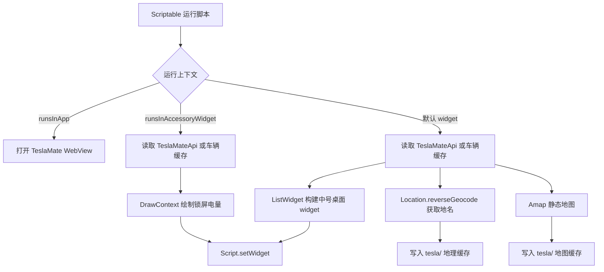

# 项目架构说明

## 文件结构

```text
.
├── AGENTS.md
├── README.md
├── README.zh-CN.md
├── Telsa Car.js
├── docs/
│   ├── architecture.md
│   ├── code-review.md
│   ├── scriptable-capabilities.md
│   ├── testing.md
│   └── *.jpg / *.png
├── package.json
└── tests/
    ├── scriptable-runtime.js
    └── scriptable-widget.test.js
```

## 运行入口

`Telsa Car.js` 是唯一 Scriptable 入口。它按运行上下文分成三条路径：

1. App 内运行：`config.runsInApp` 为真时，打开 `TESLA_MATE_URL`，并用 WebView 注入样式隐藏其他车辆卡片。
2. 锁屏 accessory widget：`config.runsInAccessoryWidget` 为真时，拉取或读取缓存车辆数据，绘制圆形电量图。
3. 桌面 widget：默认路径，拉取车辆状态、地理编码和地图，构建中号 widget。

项目继续采用单文件分发，用户只需安装和配置 `Telsa Car.js`。脚本内部按职责划分为命名函数：

- `main()`：仅根据 Scriptable 运行上下文分发执行路径。
- `openTeslaMateWebView()`：处理 App 内 TeslaMate 页面展示。
- `loadCarDataWithCache()`：统一处理 TeslaMateApi 请求和车辆缓存回退。
- `loadCarContext()`：组合车辆数据、历史坐标、刷新时间、地理信息和地图。
- `renderAccessoryWidget()`：绘制并提交锁屏圆形 Widget。
- `renderMediumWidget()`：组织中号 Widget，并分别调用车辆、电池、充电、控制状态、位置和地图渲染函数。

这种结构不依赖 `importModule()` 或构建流程，保持单文件安装体验，同时避免运行分支、缓存逻辑和 UI 绘制继续堆叠在顶层作用域。

## 数据流



## 配置项

需要用户在脚本顶部手动配置：

| 变量 | 含义 |
| --- | --- |
| `AMAP_API_KEY` | 高德静态地图 API Key |
| `TESLA_MATE_CAR_ID` | 车辆 ID，默认从 `args.widgetParameter` 中读取数字 |
| `TESLA_MATE_API_URL` | TeslaMateApi 车辆状态接口 |
| `TESLA_MATE_URL` | TeslaMate Web 页面地址 |

`args.widgetParameter` 支持示例：

- `1`：使用车辆 ID 1。
- `dark,1`：保留 dark 标记，同时使用车辆 ID 1。
- `1,dark`：同上。

## TeslaMateApi 数据契约

脚本期望接口返回：

```json
{
  "data": {
    "status": {
      "display_name": "Model Y",
      "state": "online",
      "state_since": "2026-07-04T08:00:00.000Z",
      "battery_details": {
        "battery_level": 67,
        "rated_battery_range": 331.2
      },
      "car_geodata": {
        "latitude": 31.2304,
        "longitude": 121.4737
      },
      "car_status": {
        "locked": true,
        "is_user_present": false,
        "windows_open": false,
        "doors_open": false,
        "sentry_mode": false
      },
      "charging_details": {
        "charge_limit_soc": 80,
        "charger_power": 0,
        "time_to_full_charge": 0
      },
      "climate_details": {
        "is_climate_on": false
      },
      "driving_details": {
        "heading": 92,
        "speed": 0
      },
      "car_versions": {
        "update_available": false
      },
      "tpms_details": {
        "tpms_pressure_fl": 2.6,
        "tpms_pressure_fr": 2.6,
        "tpms_pressure_rl": 2.6,
        "tpms_pressure_rr": 2.6
      }
    }
  }
}
```

## 缓存策略

- `car_data_<carId>.json`：TeslaMateApi 最近一次成功响应。
- `car_map_<carId>.json`：反向地理编码结果。
- `car_map_<carId>.png`：静态地图图片。

当 TeslaMateApi 请求失败时，脚本会尝试读取 `car_data_<carId>.json`。如果首跑没有缓存，脚本应继续抛出真实错误，避免显示伪数据。

## 本地测试架构

`tests/scriptable-runtime.js` 在 Node 中提供 Scriptable API stub：

- `FileManager` 映射到临时目录。
- `Request` 返回测试注入的 TeslaMate 响应和假图片。
- `ListWidget` / `WidgetStack` 记录 widget 树。
- `DrawContext` 记录绘图操作并返回假图片对象。
- `WebView` 记录打开 URL 和注入的 JavaScript。

这套机制用于证明脚本主要分支能执行、缓存可写入、关键文字和刷新时间符合预期。
